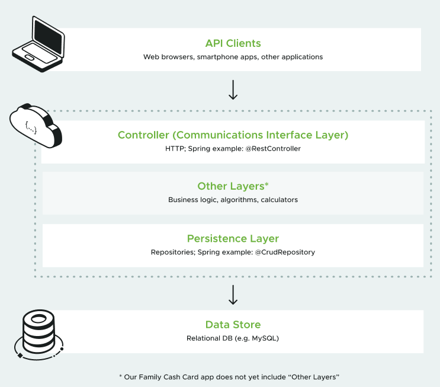

# Family Cash Card

O Family Cash Card é uma API desenvolvida durante o curso do [Spring Academy](https://spring.academy/courses/building-a-rest-api-with-spring-boot/lessons/introduction). Seu objetivo é permitir que pais gerenciem as mesadas dos filhos virtualmente.

## Sumário

1. [Funcionalidades](#funcionalidades)
2. [Arquitetura](#arquitetura)
3. [Modelo de Desenvolvimento](#modelo-de-desenvolvimento)
4. [Tecnologias Utilizadas](#tecnologias-utilizadas)

### Funcionalidades
- Criação, Edição e Exclusão de Cartões de Dinheiro
- Autenticação e Autorização com Spring Security
- Paginação e Ordenação de cartões
- API REST seguindo as melhores práticas

### Arquitetura

A aplicação foi desenvolvida utilizando uma arquitetura em camadas, dividida em:

- Camada de Segurança (Spring Security):
    - Configuração de segurança para proteger os endpoints.
    - Implementação de autenticação básica e autorização baseada em roles.

- Camada de Controle (Controllers):
    - Controladores REST para gerenciar requisições HTTP.
    - Endpoints para operações CRUD (Create, Read, Update, Delete) dos Cash Cards.

- Camada de Serviço (Services):
    - Implementação da lógica de negócios.
    - Intermediação entre a camada de controle e a camada de dados.

- Camada de Dados (Repositories):
    - Interface com o banco de dados utilizando Spring Data JPA.
    - Repositórios para operações de persistência de dados.

### Modelo de Desenvolvimento

O desenvolvimento da aplicação seguiu os seguintes princípios e práticas:

- RESTful API: A aplicação foi projetada seguindo os princípios REST, utilizando verbos HTTP apropriados (GET, POST, PUT, DELETE) e códigos de status (200 OK, 201 Created, 204 No Content, 404 Not Found).

- Test-Driven Development (TDD): Utilização de TDD para garantir que cada funcionalidade fosse devidamente testada antes de ser implementada. Testes unitários e de integração foram desenvolvidos utilizando JUnit.

- Steel Thread: Abordagem de desenvolvimento inicial para validar todos os pontos de integração e a arquitetura desde o início, minimizando riscos de funcionalidade.

- Red, Green, Refactor: Processo de desenvolvimento iterativo onde o código é primeiro escrito para falhar (Red), depois para passar (Green) e, em seguida, é refatorado para melhoria contínua.

### Tecnologias Utilizadas
- Java
- Spring Boot
- Spring Security
- Spring Data JPA